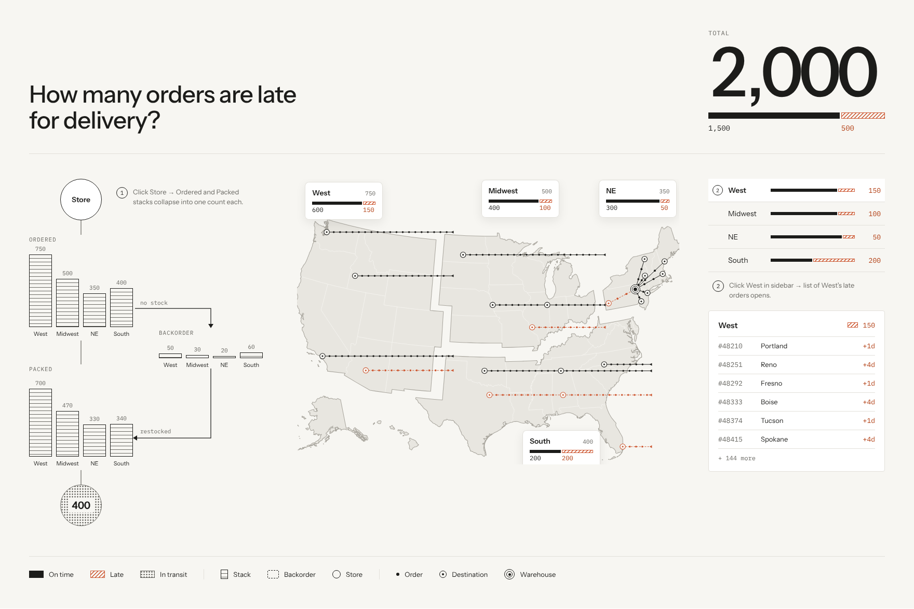
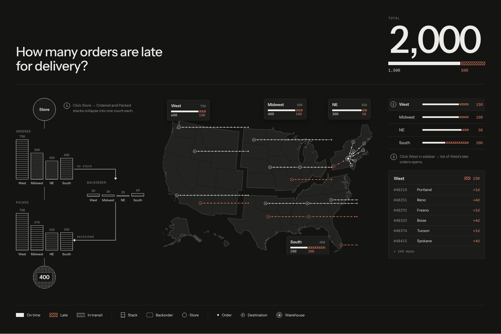

# Design Spec

> **Owner:** Design · **Status:** Proposed · **Last updated:** 2026-10-07

## Purpose
What every zone of the one-page design shows, and the visual rules.

## The design




*Light and dark themes. Same layout, same fills; only the palette changes.*

## Layout


<details><summary>Plain-text version</summary>

```
┌──────────────────────────────────────────────────────────────┐
│ Title (left)                                      TOTAL (right)│
├───────────────┬────────────────────────────┬─────────────────┤
│ PIPELINE      │ MAP                        │ SUMMARY         │
│ Store         │ US map, 4 regions          │ Region bars     │
│ Ordered stacks│ Region cards               │ Late-orders list│
│ Backorder     │ Lanes, dots, destinations  │                 │
│ Packed stacks │ Warehouse marker (NE)      │                 │
│ In transit    │                            │                 │
├───────────────┴────────────────────────────┴─────────────────┤
│ LEGEND                                                         │
└──────────────────────────────────────────────────────────────┘
```
</details>

## Zones

**Header**
- Title: "How many orders are late for delivery?"
- TOTAL: the largest element on the page. One proportional bar under it, with counts.

**Pipeline (right column, under the summary rows)**
- Store circle at the top. Orders flow down from it.
- Flow lines (D-010): Store → Ordered. Ordered → Packed (orders that were in stock). Ordered → Backorder ("no stock"). Backorder → Packed ("restocked"). Packed → In transit.
- Every stack has its region name under it and its count above it. Each stage has a small title: ORDERED, BACKORDER, PACKED.
- ORDERED: one stack per region, with the count above each.
- BACKORDER: one small stack per region. Arrow in labeled "no stock." Arrow out to Packed labeled "restocked."
- PACKED: one stack per region.
- IN TRANSIT: one dotted circle with a count.

**Map (wide left column, about three quarters of the width)**
- US map split into four regions, including Alaska and Hawaii insets.
- Each region has a card: name, total, one proportional bar, counts.
- Regions are drawn **apart, with a gap** between them (D-009).
- Lanes: lines with a ring for each late order day, ending at destination markers. On-time orders get no dot (D-013).
  - In the warehouse's region (NE): straight spokes from the warehouse to each destination.
  - In every other region: straight **horizontal** lines at the city's latitude. They run west to the destination marker from a common end just past the region's east side, with an arrowhead there pointing west.
- Destinations are the 51 state capitals, one lane per city, and lanes never overlap (D-010). A city's on-time and late shipments share its one lane: dashed and accent from the newest late day to the city. Only late days carry a ring (D-013).
- Late lanes use the late fill (dashed, accent color).
- Warehouse marker in NE with spokes to nearby destinations.

**Summary (right column, under the TOTAL)**
- One row per region: name, proportional bar, late count.
- Clicking a region row opens that region's late-orders list.
- List row: order number, city, days late (e.g. "+4d").
- List shows 6 rows, then "+ N more."

**Legend (footer)**
- On time, Late, In transit, Stack, Backorder, Store, Late order day (a ring, with a note that size = orders that day; there is no on-time dot, D-013), Destination, Warehouse.

## Visual rules


*Rules 1–4 in practice. South is the only region at 50% late; the equal-length bars make that obvious.*

1. **State words appear only in the legend.** Bars and cards show numbers only.
2. **Color is never alone.** Every state has a fill pattern too (solid, hatched, dotted), so it works for colorblind viewers and in grayscale.
3. **Bars are proportional.** Same total length; split by ratio.
4. **Callouts are numbered** (①, ②) and say what happens on click.
5. **Every number comes from** [Seed Data](06-seed-data.md).

## Callouts
- ① Click Store → Ordered and Packed stacks collapse into one count each.
- ② Click West in sidebar → list of West's late orders opens.

## Known gaps
- OPEN-01: Packed is 1,840 but In transit is 400. Where are the other 1,440?
- OPEN-02: At-risk is not in the legend. Is it in v1?
- ~~OPEN-03~~ Closed by [D-009](14-decisions-log.md): horizontal lanes outside the warehouse region, spokes inside it.

## Depends on
[Glossary](02-glossary.md) · [Seed Data](06-seed-data.md)
