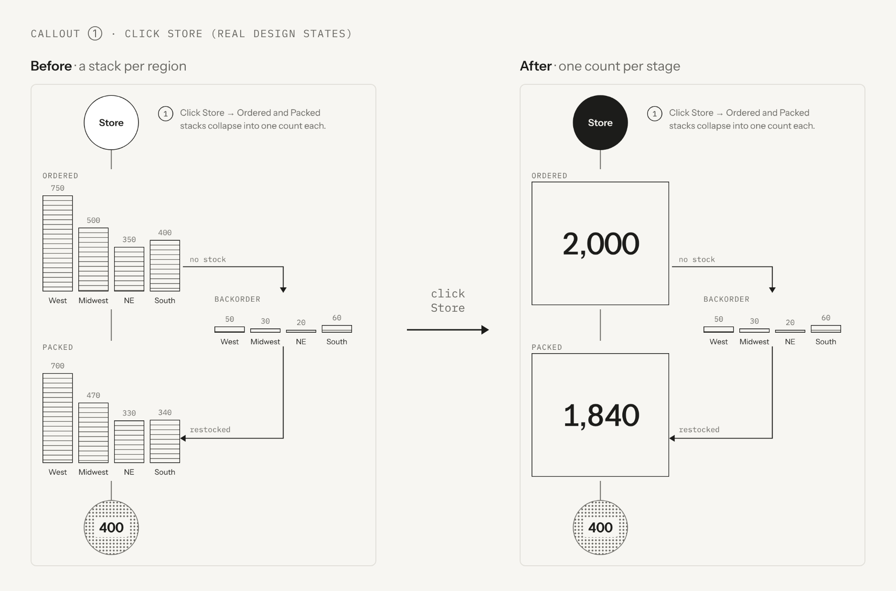
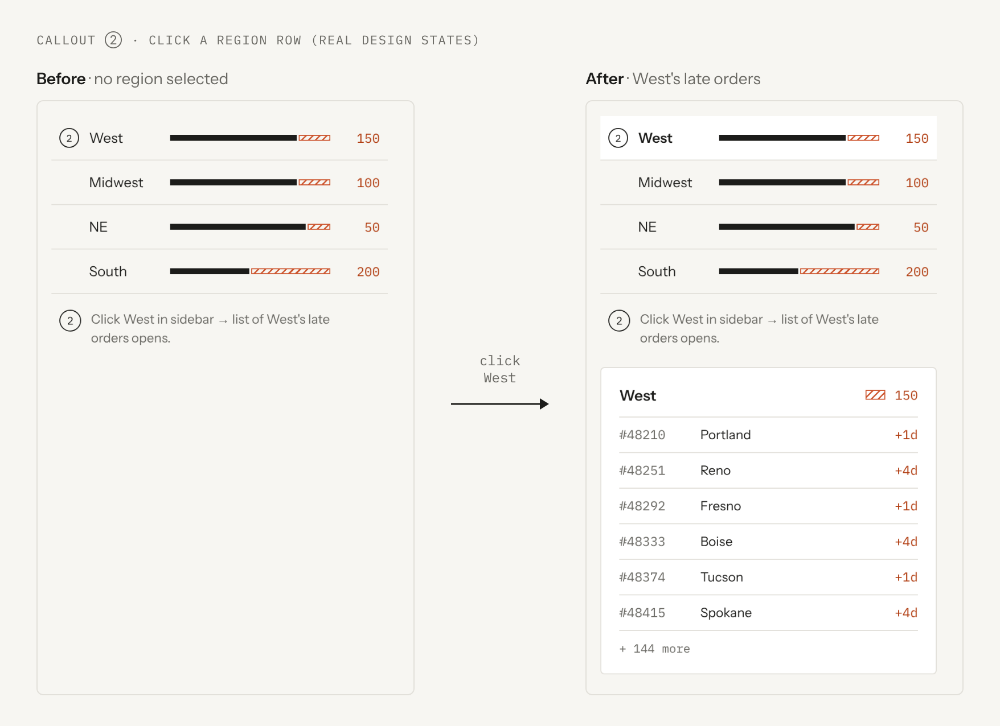

# Interactions & Animation

> **Owner:** 3D + Frontend · **Status:** Built (M9) · **Last updated:** 2026-10-07

## Purpose
What happens when the user clicks, hovers, or waits.

## Callout ① — Click Store
- **Result:** Ordered and Packed stacks collapse into one count each.
- **State:** toggles `pipelineCollapsed`.
- **Motion:** stacks slide together and stretch into one box over ~300 ms, then a total fades in. Click again to expand.
- **Built:** the Store circle is a button (keyboard works); it fills in while collapsed.

*Captured from the real design.*

## Callout ② — Click a region in the sidebar
- **Result:** That region's late-orders list opens.
- **State:** sets `selectedRegion`.
- **Map response:** the selected region stays at full strength; the others fade (map, lanes, beads, cards). Built.
- **Data:** fetch `/api/regions/[region]/late`.

*Captured from the real design. The map fade is not in the design yet.*

## Hover (proposed)
- Hover a region on the map → its sidebar row highlights.
- Hover a destination → small tooltip with city and order count.

## Shipment motion: the weekly loop (decided by Kuko, closes OPEN-09)
A "Play week" button (bottom-left of the map, `WeekControl`) replays how the orders could move in a week. Off by default, so the page is still until someone presses it.
- **Clock:** 7 days (Mon-Sun) in 14 s (`DAY_SECONDS = 2`), then a 0.75-day rest on the finished week, then it restarts. Code: `components/three/weekClock.ts` (pure, tested); `WeekBeads.tsx` runs it.
- **What moves:** every order-day bead leaves the lane start (arrowhead or warehouse) and slides to its resting slot. The oldest orders leave first (Mon) and the newest last; each trip takes 2.5 days.
- **On arrival:** late rings stay put. On-time discs fade to the page color over 1 day, so at Sunday the map is exactly the still map (late rings only).
- **Pause** freezes the frame (and the day); Play resumes. Pressing Play after the end-state starts a fresh week.
- **Day counter:** 3D writes `weekDay` (0-6) to the store when the day changes; `WeekControl` underlines it.
- **Numbers:** motion never hides them; cards, totals and the late list are DOM and keep updating with the API.
- **Canvas:** it still draws on demand; while the loop plays, each frame asks for the next (`invalidate`). A frame after a long idle is capped at 0.5 s of clock.

## Reduced motion
If the user's system has "reduce motion" on, skip all animation and show the end state immediately. For the weekly loop that means `WeekControl` is not rendered and the beads stay on the still map.

## Keyboard
- Tab through sidebar rows; Enter opens the list.
- Escape closes the list and clears `selectedRegion`.

## Depends on
[3D Scene](10-three-scene.md) · [Frontend DOM](09-frontend-dom.md)
